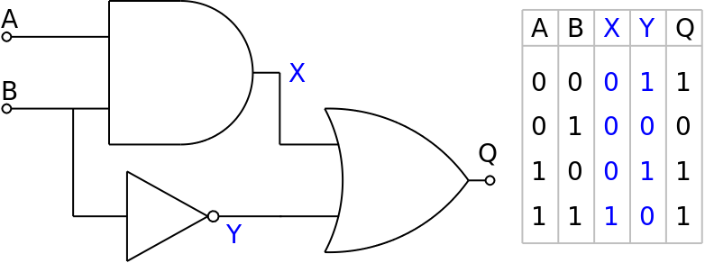

# ZK Circuit Implementation Challenge

This is My Module 3 Assessement of POLY PROOF Advanced Cource at Metacrafters Training.

# owner @Gaurav from Chandigarh University

## Introduction

Zardkat is a zero-knowledge proof circuit implemented using Circom. It verifies whether the multiplication of two inputs is correct without revealing the inputs themselves.
- Your goal is to prove you know the inputs A (0) & B (1) that yield a 0 output.

## Circuit


## Functionality

The Zardkat circuit performs the following steps:

1. Takes two input signals, `a` and `b`.
2. Utilizes logic gates (`AND`, `NOT`, `OR`) to calculate the output signal, `q`.
3. The circuit ensures that `q` is the correct multiplication of `a` and `b`.
4. The circuit uses zero-knowledge proof techniques to verify the correctness of the multiplication without revealing the inputs.

## Installation

1. Clone the repository:

   ```
   git clone https://github.com/gmchad/zardkat.git
   ```

## Install the dependencies:

    ```
    cd zardkat
    npm i
    ```
## Usage
1. Compile the Circom circuit:

    ```
    npx hardhat circom
    ```
2. Run the deployment script:

    ```
    Copy code
    npx hardhat run scripts/deploy.ts --network goerli
    ```
This will deploy the Zardkat circuit on the Goerli network.
# video explamation
https://www.loom.com/share/a974db4a97c04f20ac06fa008cfa14db?sid=e21bcb3f-14ad-4e95-89d9-28162d5376eb
## Credits

The logic gates circuit implementation is based on the `circuits/gates.circom` from the [circomlib](https://github.com/iden3/circomlib) repository by iden3.

## License

This project is licensed under the **MIT License**.
